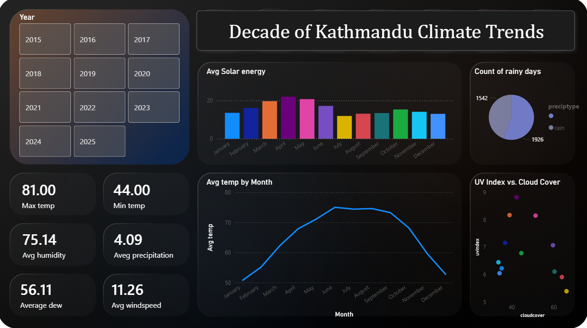

# 🌤️ Decade of Kathmandu Climate Trends (2015 - 2025)

An elegant, dark-themed Power BI dashboard analyzing 10 years of historical climate and weather data for Kathmandu, Nepal (recorded at Tribhuvan International Airport).

## 📊 Dashboard Preview

## 🔍 Key Insights & Visualizations
* **Temperature Waves:** Tracks long-term monthly cycles, highlighting Kathmandu's maximum recorded temp ($102.1^\circ\text{F}$) and minimum temp ($32.1^\circ\text{F}$).
* **Solar Energy Patterns:** A colorful bar chart showcasing average solar radiation peaking beautifully during April and May.
* **Rainfall Metrics:** A clean donut chart breaking down the ratio of rainy days versus clear, dry days.
* **Climate Correlations:** A scatter plot analyzing the direct relationship between **UV Index vs. Cloud Cover** grouped by month.

## 🛠️ Data Engineering & Tools Used
* **Power BI Desktop:** Core dashboard assembly, canvas grid layouts, UI/UX asset positioning.
* **Power Query:** Cleansing data types, removing blank artifacts, and managing data summaries (changing sums to averages for windspeed and dew points).
* **Git & GitHub:** Version control and cloud hosting for portfolio sharing.

## 📁 Project Structure
* `dashboard.pbix` - The complete interactive Power BI project file.
* `dashboard.png` - Snapshot image of the final UI/UX layout.
* `kathmandu weather.csv` - Raw 10-year historical dataset file.
